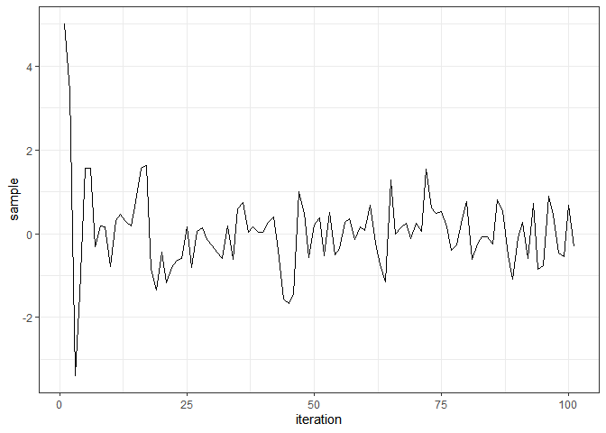

<!-- README.md is generated from README.Rmd. Please edit that file -->
<!-- # GPHS -->
<!-- badges: start -->
<!-- badges: end -->

## GPHS: Hyperparameter selection in Gaussian Process models

The R package ‘GPHS’ provides the users with various algorithms for MCMC
update of the hyperparameters in covariance function in Gaussian process
models. It includes the Elliptical Slice Sampling algorithm as discussed
in [Nishihara, Murray and Adams
(2014)](https://www.cs.princeton.edu/~rpa/pubs/nishihara2014generalized.pdf)
and Metropolis-Hastings algorithm and Slice sampling algorithm for the
Surrogate data model as discussed in [Murray et
al. (2010)](https://arxiv.org/abs/1001.0175). In addition to these
functions, the package also provides the users with a function to invert
a matrix using Eigen decomposition, and a function to calculate the
density of a multivariate normal distribution.

### Installation

You can install the most recent version of ‘GPHS’ package from
[GitHub](https://github.com/niladrik/GPHS) using the following commands:

``` r
# Plain installation
devtools::install_github("niladrik/GPHS")
```

``` r
# For installation with vignette
devtools::install_github("niladrik/GPHS", build_vignettes = TRUE)
```

For installation with vignette, $\LaTeX$ should be pre-installed in your
machine

### Examples

Here we would give an illustration of the function `ESS`.  

We begin by defining the log likelihood function

``` r
library(GPHS)
set.seed(12345)

## defining the log likelihood function
logl = function(y, mu = rep(0, length(y)), sigma = diag(1, length(y))){
  d = mvtnorm::dmvnorm(y, mu, sigma)
  log.val = log(d)
  return(log.val)
}
```

Then we fix some random starting points for the parameter of interest:
`x`, and we run the `ESS` update 100 times.

``` r
## number of updates
n = 100
## vector of generated x
x_vec = vector("numeric", n + 1)
## starting point
x_vec[1] = 5
## dimension of current state
p = length(x_vec[1])
## ESS update
for(i in 1:n){
  x_vec[i+1] = ESS(x = x_vec[i], mu = rep(0, p), sigma = diag(1, p), log.L = logl, niter = 100)
}
```

The trace plot of the samples drawn is:
 The
Metropolis-Hastings and the Slice sampling algorithms for Surrogate data
model are implemented in `SurrogateMH` and `SurrogateSS` respectively.
For the illustration of these functions, please refer to the vignette.  
This package also contains two other functions:`mySolve` and
`dmvnorm_own`. The function `mySolve` helps to find the inverse,
determinant and square-root decomposition of (symmetric) matrices that
are nearly positive-definite.

``` r
A = diag(1:2)
mySolve(A)
#> $inv
#>      [,1] [,2]
#> [1,]    1  0.0
#> [2,]    0  0.5
#> 
#> $det
#> [1] 2
#> 
#> $sqrtDeco
#>      [,1]     [,2]
#> [1,]    1 0.000000
#> [2,]    0 1.414214
```

The function `dmvnorm_own` gives the density of a multivariate Normal
distribution. For illustration, suppose we want to find the density of
(0,0) when it is drawn from $N(0,0.1\times I)$ distribution

``` r
dmvnorm_own(y = c(0, 0))
#> [1] 0.1575713
```

### References

Murray, I., & Adams, R. P. (2010). Slice sampling covariance
hyperparameters of latent Gaussian models. *Advances in neural
information processing systems, 23.*
<https://doi.org/10.48550/arXiv.1006.0868>

Murray, I., Adams, R., & MacKay, D. (2010, March). Elliptical slice
sampling. In *Proceedings of the thirteenth international conference on
artificial intelligence and statistics* (pp. 541-548). JMLR Workshop and
Conference Proceedings. <https://doi.org/10.48550/arxiv.1001.0175>

Nishihara, R., Murray, I., & Adams, R. P. (2014). Parallel MCMC with
generalized elliptical slice sampling. *The Journal of Machine Learning
Research, 15(1)*, 2087-2112. <https://doi.org/10.48550/arXiv.1210.7477>
